# ⚡ PulseLink IoT System

<div align="center">


</div>

<div align="center">

## 🚀 Development Status


## 🌐 Connect With Me

[](https://www.linkedin.com/in/pierre-mvita/)
[](https://pierre-mvita.vercel.app/)
[](mailto:Petermvita@hotmail.com)

## 📱 Mobile App Stack


## 🔌 Backend & Communication


## 🌐 IoT & Future Integrations


</div>

A complete fullstack monorepo project for real-time IoT device control, built with **npm workspaces**. Contains an Expo mobile app and a Node.js WebSocket device simulator.

## 🧩 Project Structure

```
pulselink/
├── apps/
│   ├── mobile/          # Expo React Native app
│   └── simulator/       # Node.js WebSocket server
├── package.json         # Root workspace config
└── README.md
```

## ✨ Features

### Mobile App (`apps/mobile`)
- Real-time IoT dashboard with device status
- WebSocket connection with auto-reconnect
- Device control (toggle switches)
- Live activity console
- Offline state persistence
- Beautiful UI with NativeWind (Tailwind CSS)
- Expo Router for navigation

### Device Simulator (`apps/simulator`)
- WebSocket server on port 8080
- Mock IoT devices (lamps, fans, sensors)
- Real-time broadcasting to all connected clients
- Automatic sensor value generation
- Colored console logging

## 🚀 Quick Start

### Prerequisites

- Node.js 18+ and npm
- For mobile app: Expo Go app on your device, or iOS Simulator / Android Emulator

### Installation

1. **Install all dependencies** (from root):

```bash
cd pulselink
npm install --legacy-peer-deps
```

**Note:** We use `--legacy-peer-deps` to resolve a minor React version conflict between React Native (requires React 18.2.0) and react-dom (requires React 18.3.1). The app will work correctly with either version.

Alternatively, you can use the convenience script:
```bash
npm run install:all
```

This will install dependencies for both workspaces automatically.

### Running the Projects

#### Option 1: Run from Root (Recommended)

**Terminal 1 - Start the simulator:**
```bash
npm run start:sim
```

**Terminal 2 - Start the mobile app:**
```bash
npm run start:mobile
```

#### Option 2: Run Independently

**Simulator:**
```bash
cd apps/simulator
npm start
```

**Mobile App:**
```bash
cd apps/mobile
npx expo start
```

### Connecting to the App

1. Start the simulator server (should show: `WebSocket server running on ws://localhost:8080`)
2. Start the Expo app
3. Scan the QR code with Expo Go (iOS/Android) or press `i` for iOS simulator / `a` for Android emulator
4. The app will automatically connect to `ws://localhost:8080`

## 📱 Testing on Physical Devices

If testing on a physical device (not simulator/emulator), you need to expose the WebSocket server:

1. **Install ngrok:**
```bash
npm install -g ngrok
```

2. **Expose port 8080:**
```bash
npx ngrok http 8080
```

3. **Update WebSocket URL:**
   - Copy the ngrok HTTPS URL (e.g., `wss://abc123.ngrok.io`)
   - Update `WS_URL` in `apps/mobile/hooks/useWebSocket.ts`:
   ```typescript
   const WS_URL = "wss://your-ngrok-url.ngrok.io";
   ```

## 🧪 Mock Devices

The simulator includes these devices:

- **Smart Lamp** (`lamp-1`) - Toggle on/off
- **Ceiling Fan** (`fan-1`) - Toggle on/off
- **Temperature Sensor** (`sensor-1`) - Auto-updates every 3 seconds (18-26°C)
- **Humidity Sensor** (`sensor-2`) - Auto-updates every 3 seconds (30-70%)

## 📡 WebSocket Protocol

### System Architecture

```mermaid
flowchart TB
    subgraph MOBILE["📱 Mobile App"]
        APP["⚛️ React Native App<br/>(Expo)"]
        WS_CLIENT["🔌 WebSocket Client"]
        STATE["📦 Zustand State<br/>Management"]
    end

    subgraph SIMULATOR["🖥️ Device Simulator"]
        WS_SERVER["🌐 WebSocket Server<br/>(Port 8080)"]
        DEVICES["📱 Mock IoT Devices"]
    end

    subgraph DEVICE_LIST["💡 Devices"]
        LAMP["💡 Smart Lamp<br/>(lamp-1)"]
        FAN["🌀 Ceiling Fan<br/>(fan-1)"]
        TEMP["🌡️ Temperature Sensor<br/>(sensor-1)"]
        HUMID["💧 Humidity Sensor<br/>(sensor-2)"]
    end

    APP --> WS_CLIENT
    WS_CLIENT <--> WS_SERVER
    WS_SERVER --> DEVICES
    DEVICES --> LAMP
    DEVICES --> FAN
    DEVICES --> TEMP
    DEVICES --> HUMID
    
    WS_CLIENT --> STATE
    STATE --> APP

    style MOBILE fill:#E8F5E9,stroke:#4CAF50,color:#000
    style SIMULATOR fill:#E3F2FD,stroke:#2196F3,color:#000
    style DEVICE_LIST fill:#FFF3E0,stroke:#FF9800,color:#000
```



### WebSocket Communication Flow


### Client → Server

Toggle device:
```json
{
  "deviceId": "lamp-1",
  "action": "toggle",
  "value": true
}
```

### Server → Client

Initial device list:
```json
{
  "type": "devices",
  "devices": [
    {
      "id": "lamp-1",
      "name": "Smart Lamp",
      "type": "switch",
      "status": "off",
      "value": false
    }
  ]
}
```

Device update:
```json
{
  "type": "deviceUpdate",
  "deviceId": "lamp-1",
  "status": "on",
  "value": true
}
```

## 🛠️ Development

### Project Scripts

**Root level:**
- `npm run start:sim` - Start WebSocket simulator
- `npm run start:mobile` - Start Expo app
- `npm run install:all` - Install all workspace dependencies
- `npm run clean` - Remove all node_modules

**Mobile app (`apps/mobile`):**
- `npm start` - Start Expo dev server
- `npm run android` - Start on Android
- `npm run ios` - Start on iOS
- `npm run web` - Start web version

**Simulator (`apps/simulator`):**
- `npm start` - Start WebSocket server
- `npm run dev` - Start with watch mode

### Tech Stack

**Mobile App:**
- Expo SDK 51+
- React Native (TypeScript)
- Zustand (state management)
- NativeWind (Tailwind CSS)
- Expo Router (navigation)
- AsyncStorage (persistence)

**Simulator:**
- Node.js (ES Modules)
- `ws` (WebSocket library)
- `chalk` (colored logging)

## 🎨 Features in Detail

### Mobile App

- **Dashboard Screen** - Lists all connected devices with status indicators
- **Device Detail Screen** - Shows device info, real-time value, control button, and activity log
- **WebSocket Hook** - Handles connection, reconnection, and message parsing
- **State Management** - Zustand store with AsyncStorage persistence
- **Live Console** - Shows all WebSocket messages (sent/received/errors)

### Simulator

- **Multi-client Support** - Multiple app instances can connect simultaneously
- **Auto-updates** - Sensors update values every 3 seconds
- **Broadcasting** - All clients receive device updates in real-time
- **Colored Logging** - Easy-to-read console output

## 📝 Future Enhancements

- [ ] Add charts (Recharts) for sensor history
- [ ] Add settings page with custom themes
- [ ] Integrate AWS IoT Core (MQTT)
- [ ] Add push notifications for device events
- [ ] Device grouping and scenes
- [ ] Historical data storage

## 📊 GitHub Stats

<div align="center">


</div>

## 🤝 Contributing

1. Fork the repository
2. Create a feature branch
3. Make your changes
4. Submit a pull request

## 📄 License

MIT

## 🙏 Acknowledgments

Built with ❤️ using Expo, React Native, and Node.js.

